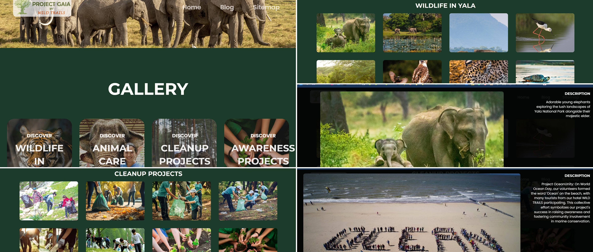
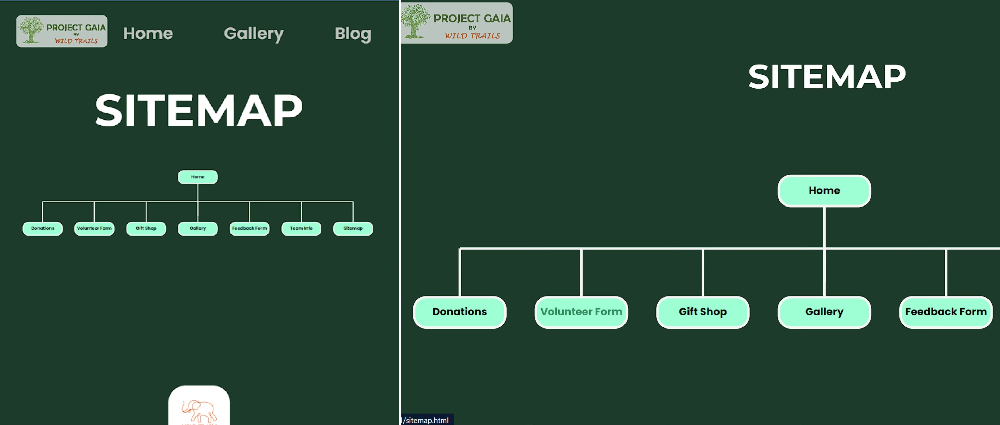
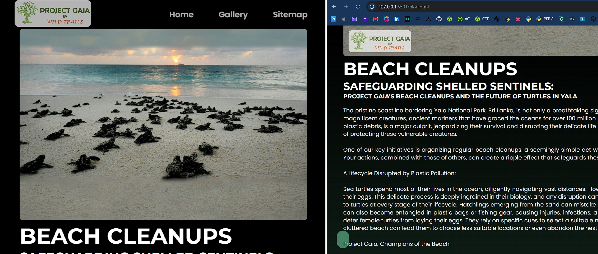
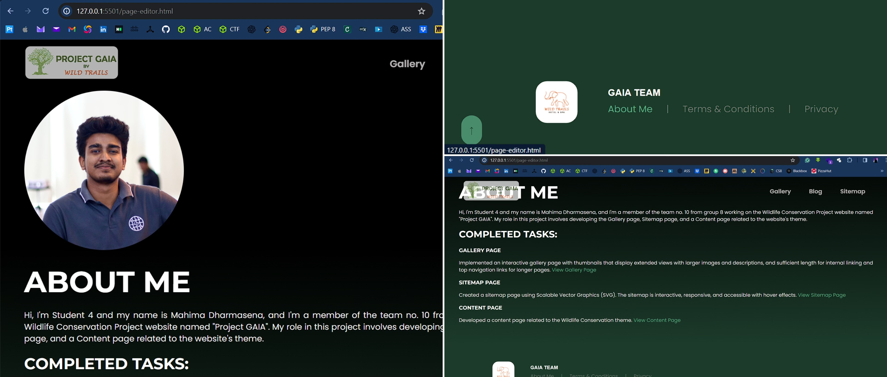

# project-gaia-gallery
(IITWebDev Branch: dev-md)

Welcome to our IIT/UoW Web Design & Development Coursework project repository! This part was maintained by Mahima Dharmasena.

# Project GAIA: Wildlife Conservation at WILD TRAILS - Hotel & Spa

Welcome to Project GAIA by WILD TRAILS - Hotel & Spa, situated alongside the mesmerizing Yala National Park. As champions of sustainability, we are deeply committed to fostering a harmonious relationship between humans and wildlife.

At the heart of Project GAIA lies our advanced Wildlife Vet Clinic, dedicated to ensuring the well-being of the park's diverse fauna. Our mission extends beyond medical care; we are passionate about educating the public on wildlife conservation. Seasonal volunteer opportunities allow participants to engage hands-on, from assisting in our vet clinic to immersive wildlife tours.

Support our cause by exploring our curated range of merchandise at our on-site shop, featuring volunteer t-shirts, safari-themed apparel, eco-friendly bags, and more. Every purchase directly contributes to our conservation efforts.

Check out our online gallery to witness our conservation journey through captivating images of our vet clinic, rescue operations, beach cleanups, and the dedicated volunteers who drive our mission forward.

Join us in making a difference. Visit our website to create a volunteer profile or make a donation, and help us protect the future of Yala's magnificent wildlife through Project GAIA.

### As Student 4, my responsibilities in this project were as follows:

1. **Gallery Page**
   - Implemented an interactive gallery page with thumbnails
   - Displayed an extended view with larger images and descriptions
   - Ensured sufficient length for internal linking
   
   

2. **Sitemap Page**
   - Created a sitemap page using Scalable Vector Graphics (SVG)
   - Made the sitemap interactive, responsive, and accessible 
   - Provided keyboard navigation and hover effects

   

3. **Content Page (Blog)**
   - Developed a content page related to the website's theme (Wildlife Conservation)

   

4. **Page Editor**
   - Created a personal page editor with my name, role, completed tasks, and links to my work
   - Ensured the pages open in a new tabs

   

## How to Install and Run the Project

To install and run the project, follow these steps:

1. Clone the repository to your local machine:
   ```
   git clone https://github.com/your-username/project-gaia-gallery.git
   ```

2. Navigate to the project directory:
   ```
   cd project-gaia-gallery
   ```

3. Install the required dependencies:
   ```
   npm install
   ```

4. Start the development server:
   ```
   npm start
   ```

5. Open your web browser and visit `http://localhost:3000` to view the project.

Note: Make sure you have Node.js and npm installed on your machine before running the project.

## How to Use the Project

To use the project, follow these steps:

1. Explore the gallery page to view captivating images of our vet clinic, rescue operations, beach cleanups, and dedicated volunteers.

2. Navigate to the sitemap page to get an overview of the website's structure and easily navigate to different sections.

3. Read the content page (blog) to learn more about wildlife conservation and our efforts in protecting the future of Yala's magnificent wildlife.

4. Visit the page editor to see my contributions to the project, including my name, role, completed tasks, and links to my work.

Feel free to explore the website further, create a volunteer profile, make a donation, and support our cause in protecting wildlife through Project GAIA.

## How to Contribute to the Project

To contribute to the project, please follow these steps:

1. Fork the repository on GitHub by clicking the "Fork" button.

2. Clone your forked repository to your local machine:
   ```
   git clone https://github.com/your-username/project-gaia-gallery.git
   ```

3. Navigate to the project directory:
   ```
   cd project-gaia-gallery
   ```

4. Create a new branch for your contribution:
   ```
   git checkout -b your-branch-name
   ```

5. Make your desired changes to the project.

6. Commit your changes:
   ```
   git commit -m "Add your commit message here"
   ```

7. Push your changes to your forked repository:
   ```
   git push origin your-branch-name
   ```

8. Go to the original repository on GitHub and create a new pull request from your forked repository.

9. Provide a clear and descriptive title for your pull request, along with any additional comments or information.

10. Submit the pull request, and wait for the project maintainers to review and merge your changes.

Thank you for your contribution to Project GAIA!

## 💰 You can help me by Donating
[](https://buymeacoffee.com/mahiiyh) 